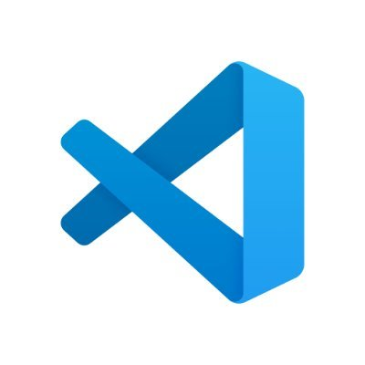

### Hello There! 👋

• My name is Jason Clegg! I am currently a student at Lambda School, studying Full Stack Web Development.

• I have worked on multiple projects, ranging from Frontend, Backend, and Algorithms.

• I am currently working on free-lance projects and brushing up on my coding skills!

<h2 align="center">Tech Stack</h2>

  

    Open :open_file_folder:
  

  <table align="center">
  <tbody>
  <tr>
  <td align="center" width="20%">
   
JavaScript
  
   
  </td>
  <td align="center" width="20%">
   
Vercel
  
   
  </td>
  <td align="center" width="20%">
   
Postgres SQL
  
   
  </td>
  </tr>
  
  <tr>
  <td align="center" width="20%">
   
React.js
  
   
  </td>
  <td align="center" width="20%">
   
Git
  
   
  </td>
  <td align="center" width="20%">
   
Python
  
   
  </td>
  </tr>

  <tr>
  <td align="center" width="20%">
   
Node.js
  
   
  </td>
  <td align="center" width="20%">
   
Visual Studio Code
  
   
  </td>
  </tr>
  </tbody>
  </table>

